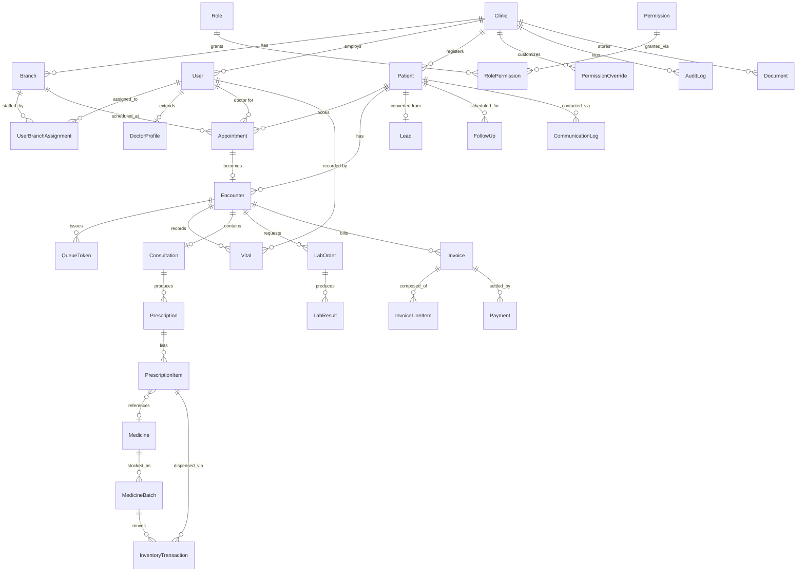

# Clinic ERP + CRM — Product Requirements & Technical Architecture

**Status:** DRAFT — pending owner approval. No implementation code exists for this product yet.
**Supersedes:** `docs/architecture.md`, `docs/database-schema.md`, `docs/api-spec.md`, and the current `backend/`/`frontend/` code, all of which describe an earlier single-tenant Node/Express/React scaffold. Those files are left in place for reference but should not be treated as the current design. See [Section 30](#30-risks-and-architectural-decisions) for what happens to that code.

**Confirmed decisions (from stakeholder input):**
- Multi-tenancy: shared database, row-level isolation (not schema- or database-per-tenant).
- Market/compliance target: India-first (DPDP Act 2023, GST invoicing, INR, WhatsApp as primary channel; ABDM/ABHA deferred but designed for).
- Stack: React + TypeScript + Vite + Tailwind CSS + shadcn/ui + TanStack Query + TanStack Form + Zod (frontend); FastAPI + Python + SQLAlchemy + Alembic + Pydantic + PostgreSQL + Redis (backend); S3-compatible object storage; Vercel (frontend), Render/Railway (backend), managed Postgres, managed Redis, S3/R2 (deployment).
- Branch model: **not explicitly confirmed** — this document proceeds on the recommended assumption of "one tenant, many branches" (Section 22). Flagged in Section 30 for confirmation.

---

## 1. Product Overview

Clinic ERP + CRM is a multi-tenant SaaS platform that lets independent outpatient clinics, polyclinics, and diagnostic centers run their entire front-desk-to-billing operation from one system, while giving the platform operator (us) a single codebase serving many clinics with strict data isolation between them.

**Primary buyer:** the clinic owner (often also the senior/managing doctor), who needs complete operational visibility without doing the data entry themselves.

**Core value proposition:**
- Replace paper registers / spreadsheets / disconnected tools (WhatsApp for scheduling, a separate billing tool, a separate pharmacy register) with one system.
- Give the owner a live, complete picture of the clinic — clinical, financial, and operational — from any device.
- Preserve a complete, tamper-evident medical and financial history per patient (never destructive).
- Be ready for India's digital health ecosystem (ABDM/ABHA) without a rewrite when that integration is prioritized.

**Not in v1 (explicitly deferred, but architected for):** ABHA/ABDM integration, telemedicine, AI receptionist, AI doctor assistant. See Sections 23–24.

**Subscription/monetization model:** not yet defined — see open question in Section 30. This affects the `Subscription`/`Plan` entities in Section 6, which are sketched but not finalized.

---

## 2. User Roles

| Role | Scope | Summary |
|---|---|---|
| **Platform Admin** *(proposed addition — see §30)* | Cross-tenant, platform-level | Not a clinic role. Operates the SaaS itself: provisions tenants, manages billing/subscriptions, suspends non-paying tenants, provides support (with audited, consent-based access), monitors platform health. Has no standing access to clinical data. |
| **Clinic Owner** | Tenant-wide | Full visibility and management authority across their clinic (all branches). Manages staff, doctors, permissions, settings, and sees all clinical, financial, operational, and CRM data. Usually also the subscription billing contact. |
| **Doctor** | Own patients / assigned encounters | Clinical work: consultations, diagnosis, e-prescriptions, viewing assigned patients' EMR. Read access to their own appointment schedule and (per clinic setting) can record vitals. |
| **Receptionist** | Branch-wide, front-desk scope | Patient search/registration, appointment booking, walk-in registration, check-in, queue management, basic billing, patient communication. Vitals recording is permission-gated (see below). |
| **Nurse** | Branch-wide, clinical-support scope | Vitals recording (default-on), assisting with patient prep, viewing assigned patients' clinical summary. Not diagnosis/prescription. |
| **Lab Staff** | Branch-wide, lab scope | Specimen accessioning, lab order status updates, result entry, report generation. |
| **Pharmacy Staff** | Branch-wide, pharmacy scope | Medicine catalog/inventory, batch/expiry tracking, prescription dispensing, OTC POS sales. |
| **Other Staff** | Configurable | Catch-all for roles not otherwise modeled (e.g., housekeeping lead, office admin) — owner assigns a custom permission subset rather than a fixed capability set. |
| **Patient** | Own records only | Self-service portal: book/view own appointments, view own prescriptions/reports/invoices, telemedicine (future), communication preferences. |

Every role except Platform Admin is **tenant-scoped** — a user's role and permissions apply within exactly one clinic tenant (a person working at two unrelated clinics would need two accounts, or one account with two tenant memberships — see open question in §30).

---

## 3. Permission Matrix

This is a capability-level summary. The authoritative, granular permission list is the seeded `permissions` table described in Section 13 — this table exists to sanity-check the design, not to be the implementation source of truth.

Legend: **F** = full access within tenant/branch scope · **O** = own/assigned records only · **R** = read-only · **C** = configurable by Owner (on/off per clinic, may target specific roles or specific staff) · **–** = no access

| Capability | Owner | Doctor | Receptionist | Nurse | Lab Staff | Pharmacy Staff | Other Staff | Patient |
|---|:---:|:---:|:---:|:---:|:---:|:---:|:---:|:---:|
| Clinic settings & branding | F | – | – | – | – | – | – | – |
| Staff, roles & permissions | F | – | – | – | – | – | – | – |
| Doctor profile management | F | O | – | – | – | – | – | – |
| Patient registration & search | F | R | F | R | R | R | C | – |
| Full patient EMR | F | O | R (demographics) | R (assigned) | – | – | – | O |
| Appointment booking (staff-side) | F | R (own) | F | R | – | – | C | – |
| Online booking (patient-side) | – | – | – | – | – | – | – | F (own) |
| Walk-in registration & check-in | F | R | F | R | – | – | C | – |
| Queue / token management | F | R | F | R | – | – | C | – |
| **Vitals recording** | F | C (default on) | C (default off) | C (default on) | – | – | C | – |
| Consultation, diagnosis, clinical notes | R | F (own) | – | – | – | – | – | O (read) |
| E-prescription | R | F (own) | – | – | – | – | – | O (read) |
| Billing & invoices | F | R (own) | F | – | – | – | C | O (own) |
| Payments | F | – | F | – | – | – | – | O (read) |
| Pharmacy catalog & inventory | F | R | – | – | – | F | – | – |
| Pharmacy dispensing / POS | F | – | – | – | – | F | – | – |
| Lab test catalog & orders | F | F (order) | – | – | F | – | – | – |
| Lab result entry & reports | F | R | – | – | F | – | – | O (read) |
| General inventory & expenses | F | – | – | – | – | – | C | – |
| CRM, leads, follow-ups | F | – | F | – | – | – | C | – |
| Patient communication (send) | F | – | F | – | – | – | C | – |
| Owner dashboard, analytics, reports | F | – | – | – | – | – | – | – |
| Audit logs | F (read) | – | – | – | – | – | – | – |
| Multi-branch administration | F | – | – | – | – | – | – | – |

The **vitals row is the concrete case** driving the whole permission-override design: the default matrix ships with Nurse and Doctor on, Receptionist off, but the Owner must be able to flip Receptionist on for their clinic (per the requirement) without a code change — this is what forces permissions to be data (per-tenant overrides), not hardcoded role checks. Detailed in Section 13.

---

## 4. Complete Module List

Grouped for architectural clarity (this grouping maps closely to backend module boundaries in Section 10 and API domains in Section 8).

**A. Platform & Identity**
1. Multi-tenant architecture
2. Authentication
3. RBAC and permissions
4. Clinic onboarding
5. Clinic settings
6. Multi-branch support

**B. People**
7. Doctor management
8. Staff management
9. Patient management

**C. Front Desk & Clinical Flow**
10. Online appointment booking
11. Receptionist appointment booking
12. Walk-in registration
13. Check-in
14. Queue/token management
15. Vitals
16. EMR / patient medical records
17. Consultation
18. Diagnosis
19. E-prescription

**D. Financial**
20. Billing
21. Payments
22. Invoices
23. Expenses

**E. Pharmacy & Lab**
24. Pharmacy
25. Pharmacy inventory
26. Laboratory management
27. Lab reports
28. General inventory

**F. Engagement & Growth**
29. CRM
30. Follow-ups
31. Patient communication
32. Notifications
33. Patient portal

**G. Intelligence & Oversight**
34. Owner dashboard
35. Analytics
36. Reports
37. Audit logs

**H. Advanced / Future**
38. WhatsApp/SMS/Email communication architecture (interfaces now, full integration later — §16)
39. Telemedicine (architecture only — §24)
40. AI receptionist (architecture only — §23)
41. AI doctor assistant (architecture only — §23)

**I. Platform Reliability**
42. Security
43. Backup/recovery

---

## 5. Detailed Workflows

### 5.1 Core patient journey (the requirement's 13-step flow, expanded)

1. **Online booking (patient)** — Patient (authenticated in portal, or via a public per-clinic booking link) selects branch → doctor/department → available slot. System creates `Appointment{status=SCHEDULED, source=ONLINE}`. Slot availability is derived from doctor working hours + existing appointments, not a separately maintained calendar (single source of truth).
2. **Receptionist booking** — Same slot logic, `source=RECEPTIONIST`, receptionist first searches/selects the patient record.
3. **Walk-in** — No prior appointment. Receptionist registers the visit directly into the queue; an `Appointment{source=WALK_IN, status=CHECKED_IN}` is created retroactively so downstream reporting doesn't need a separate "visit without appointment" concept.
4. **Patient search or create** — Search by phone (primary key for dedup in India-first context), MRN, or name+DOB. On no match, receptionist creates a new `Patient`. Duplicate-prevention is a soft warning (fuzzy match on phone/name/DOB), not a hard block — merge is a manual owner/admin action, never automatic (medical data must not be silently merged).
5. **Check-in** — Marks `Appointment.status=CHECKED_IN`, stamps `checked_in_at`. This is the trigger that creates the `Encounter` (the clinical/billing unit of work for this visit) if one doesn't already exist for the appointment.
6. **Token/queue generation** — On check-in, a `QueueToken` is issued, scoped to `branch_id` + `date` + optionally `doctor_id`/`department`. Sequence numbering resets daily per branch (and per doctor, if the clinic queues per-doctor). Token status machine: `WAITING → CALLED → IN_PROGRESS → DONE / NO_SHOW / SKIPPED`.
7. **Vitals** — Any staff member permitted per the tenant's permission config (§3, §13) records a `Vital` row against the `Encounter`. Multiple `Vital` rows per encounter are expected and normal — see §5.3.
8. **Consultation** — Doctor opens the `Encounter`, sees vitals history, prior encounters (EMR), allergies, chronic conditions. Consultation start/end timestamps recorded on the `Encounter`.
9. **Diagnosis / clinical notes** — Doctor records chief complaint, clinical notes, diagnosis (free text + optional ICD-10 code) on the `Consultation` record linked 1:1 to the `Encounter`.
10. **E-prescription** — Doctor creates a `Prescription` (1:1 or 1:many with `Encounter`, see §30 on refills/follow-up prescriptions) containing `PrescriptionItem` rows (medicine, dosage, frequency, duration, instructions). Prescription is immutable once issued (see §5.4) — corrections are new prescriptions referencing the original, not edits.
11. **Billing generated** — An `Encounter` can carry **multiple** `Invoice` rows, disambiguated by `Invoice.source_type` (`CONSULTATION` / `PROCEDURE` / `PHARMACY` / `LAB` / `OTHER`) — e.g. a `CONSULTATION` invoice raised at check-in and a separate `PHARMACY` invoice raised after dispensing, rather than one invoice everything must accrete onto. Only one non-VOID invoice per `source_type` is allowed per encounter (re-raising a consultation invoice for an encounter that already has one is rejected) — a different `source_type` is never blocked by an existing one. Each `Invoice` still aggregates its own `InvoiceLineItem`s the same way (consultation fee, procedures, pharmacy dispense, lab orders), just scoped to its own `source_type`.
12. **Payment recorded** — One or more `Payment` rows against an `Invoice` (supports split/partial payment, multiple methods). `Payment.recorded_by` is the "received by" staff member — always populated, surfaced to the UI as a resolved display name, not a raw id. `Invoice.status` derives from the sum of payments (`DRAFT → ISSUED → PARTIALLY_PAID → PAID`, see §17); a simplified `payment_status` (`UNPAID / PARTIAL / PAID / VOID`) is also exposed for callers that don't need the DRAFT/ISSUED distinction. It is never set directly.
13. **Patient portal access** — Patient (authenticated via phone OTP) views their own appointments, encounters (read-only clinical summary, not raw internal notes unless the clinic opts to expose them), prescriptions, lab reports, and invoices — all scoped strictly to `patient_id = self`.

### 5.2 Clinic & staff onboarding (not in the original 13 steps, but required by §2/§4)

- **Tenant provisioning:** Platform Admin (or self-serve signup flow, if offered — open question §30) creates a `Clinic` (tenant) + first `Branch` + the `Clinic Owner` user, and a `Subscription` record. A unique tenant slug is assigned for subdomain-based tenant resolution (§11).
- **Clinic settings:** Owner configures branding, working hours per branch, consultation fee defaults, tax/GST settings, permission overrides (vitals, etc.), notification templates, and default queue behavior.
- **Doctor/staff management:** Owner (or a delegated admin) invites staff by phone/email; staff accept an invite to set credentials; owner assigns role + branch(es) + any permission overrides.

### 5.3 Vitals history (explicit requirement — no overwrite)

- `Vital` is an **append-only** table: `encounter_id, patient_id, recorded_by_user_id, recorded_by_role, recorded_at, systolic_bp, diastolic_bp, heart_rate, temperature, spo2, weight_kg, height_cm, bmi (derived), notes`.
- A new reading (by any authorized role, including a doctor mid-consultation) is always a new row. The "current" vitals shown in the UI is simply the latest row per encounter — never a mutated field.
- This also means vitals trends *across* encounters (not just within one) are a first-class query (`WHERE patient_id = ? ORDER BY recorded_at`), useful for chronic-condition tracking.

### 5.4 Pharmacy dispense workflow

`Prescription` issued → Pharmacy Staff opens it in the dispense queue → for each `PrescriptionItem`, selects a `MedicineBatch` (FEFO — first-expiry-first-out, suggested by default) → confirms quantity → system creates an `InventoryTransaction{type=DISPENSE}` decrementing batch stock, and adds/updates the corresponding `InvoiceLineItem`. Partial dispense (patient takes 2 of 3 prescribed items today) is supported — `PrescriptionItem.dispensed_quantity` tracks progress independent of `prescribed_quantity`. OTC sales (no prescription) follow the same inventory-transaction path but originate from a `PharmacySale` rather than a `PrescriptionItem`.

### 5.5 Lab order-to-report workflow

Doctor orders test(s) from the tenant's `LabTestCatalog` during/after consultation → `LabOrder{status=ORDERED}` created, billed via the same `Invoice` mechanism → Lab Staff updates status through `SAMPLE_COLLECTED → PROCESSING → COMPLETED` → enters `LabResult` rows (parameter/value/unit/reference range/flag) → report is finalized (locked from edits, versioned if a correction is needed later) and becomes visible to the doctor and, per clinic setting, the patient portal.

### 5.6 CRM / follow-up workflow

Not every CRM record is a `Patient` — a `Lead` (inquiry that hasn't converted) is tracked separately with its own pipeline stage. `FollowUp` tasks (e.g., "call patient X to confirm they're taking medication," "remind for annual checkup") are assignable to staff, have a due date/status, and can be system-generated (e.g., auto-created after a diagnosis flagged as chronic) or manual. All outbound patient-facing messages, regardless of trigger, are recorded in `CommunicationLog` for CRM history and audit purposes.

### 5.7 Corrections & cancellations

Per the "no hard-delete" rule: appointment cancellation, invoice void, and prescription correction are all **state transitions with a reason**, not deletions. E.g., `Appointment.status=CANCELLED` (+ `cancelled_reason`, `cancelled_by`), `Invoice.status=VOID` (+ a reversing entry if payment was already made), a wrong `Prescription` is superseded by a new one with `supersedes_prescription_id` set, original untouched.

---

## 6. Database Entities

Grouped by domain. Every table below implicitly includes `id (UUID)`, `tenant_id` (FK to Clinic, enforced via RLS — §11), `created_at`, `updated_at`, and (for anything clinically/financially sensitive) `deleted_at` for soft-delete rather than physical deletion. Fields listed are the significant ones, not exhaustive DDL — this is a design input for the schema, not the schema itself.

**Platform / Tenancy**
- `Clinic` (tenant root) — name, slug, timezone, locale, gst_number, status (active/suspended), created_at.
- `Branch` — clinic_id, name, address, phone, timezone override (rare), working_hours.
- `Subscription` / `Plan` — clinic_id, plan_id, status, billing_cycle, seat/branch limits *(sketch only — pending §30)*.
- `TenantSetting` — clinic_id, key, value (JSON) — generic settings bag (branding, defaults, feature flags).
- `PermissionOverride` — clinic_id, role or user_id, permission_key, granted (bool) — the mechanism behind §3's "C" cells.

**Identity**
- `User` — email/phone, password_hash, status, mfa settings. A `User` can belong to exactly one `Clinic` in v1 (see §30 on multi-clinic staff).
- `Role` — system-defined (Owner, Doctor, Receptionist, Nurse, LabStaff, PharmacyStaff, OtherStaff, Patient) + clinic-scoped custom roles for "Other Staff" variants.
- `Permission` — machine key (e.g. `vitals.record`, `billing.void_invoice`), human label, module.
- `RolePermission` — default role→permission grants (the seed data behind §3).
- `UserBranchAssignment` — user_id, branch_id (staff can work multiple branches).
- `StaffProfile` / `DoctorProfile` — extends User with role-specific fields (specialization, registration number, consultation fee, working hours for doctors).

**Patients & Clinical**
- `Patient` — mrn (per-tenant unique), name, dob, gender, phone, blood_group, allergies (array), chronic_conditions (array), emergency_contact (JSON), address.
- `Appointment` — patient_id, branch_id, doctor_id, source (ONLINE/RECEPTIONIST/WALK_IN), scheduled_at, duration_minutes, status, cancelled_reason.
- `Encounter` (aka Visit) — the unit that ties one clinic visit together: appointment_id (nullable for pure walk-ins before an appointment is backfilled), patient_id, branch_id, checked_in_at, queue_token_id, status.
- `QueueToken` — encounter_id, branch_id, doctor_id, token_number, date, status.
- `Vital` — see §5.3 (append-only).
- `Consultation` — encounter_id (1:1), doctor_id, chief_complaint, clinical_notes, diagnosis_text, icd10_code, started_at, ended_at.
- `Prescription` — encounter_id, doctor_id, issued_at, supersedes_prescription_id (nullable).
- `PrescriptionItem` — prescription_id, medicine_id (nullable — free-text medicines allowed for non-catalog items), dosage, frequency, duration, prescribed_quantity, dispensed_quantity, instructions.

**Pharmacy**
- `Medicine` — clinic-scoped catalog: name, generic_name, category, dosage_form, unit_price.
- `MedicineBatch` — medicine_id, batch_number, expiry_date, quantity_on_hand, cost_price.
- `InventoryTransaction` — batch_id, type (RECEIVE/DISPENSE/ADJUST/EXPIRE_WRITE_OFF), quantity_delta, reference (prescription_item_id or pharmacy_sale_id), performed_by.
- `PharmacySale` — OTC sale not tied to a prescription; branch_id, invoice_id.

**Laboratory**
- `LabTestCatalog` — clinic-scoped: test name, category, price, reference_ranges (JSON, may vary by age/sex).
- `LabOrder` — encounter_id, ordered_by (doctor), test_id, status, ordered_at.
- `LabResult` — lab_order_id, parameter, value, unit, reference_range, flag (NORMAL/LOW/HIGH/CRITICAL), entered_by, finalized_at.

**Financial**
- `Invoice` — encounter_id (nullable for non-encounter charges; **1-to-N, not 1-to-1** — an encounter may carry several invoices), source_type (CONSULTATION/PROCEDURE/PHARMACY/LAB/OTHER — disambiguates which invoice this is when an encounter has more than one; at most one non-VOID invoice per source_type per encounter), patient_id, subtotal, tax, discount, total, status (derived), voided_at/reason.
- `InvoiceLineItem` — invoice_id, source_type (CONSULTATION/PROCEDURE/PHARMACY/LAB), source_id, description, quantity, unit_price, total.
- `Payment` — invoice_id, amount, method (CASH/CARD/UPI/INSURANCE), gateway_reference (nullable), recorded_by ("received by" — the staff member who collected it), recorded_at.
- `Expense` — branch_id, category, amount, vendor, incurred_at, recorded_by, receipt_document_id.

**Inventory (non-pharmacy)**
- `InventoryItem` — branch_id, name, category, unit, quantity_on_hand, reorder_threshold.
- `InventoryTransactionGeneral` — mirrors pharmacy's transaction-ledger pattern for auditability.

**CRM & Communication**
- `Lead` — clinic_id, name, phone, source, stage, assigned_to, converted_patient_id (nullable).
- `FollowUp` — patient_id or lead_id, assigned_to, due_at, status, reason, auto_generated (bool), source_encounter_id (nullable).
- `NotificationTemplate` — clinic_id, channel, event_key, body_template.
- `CommunicationLog` — recipient (patient_id or lead_id), channel, template_id, status (SENT/DELIVERED/FAILED), provider_message_id, consent_basis.

**Platform reliability**
- `AuditLog` — append-only: tenant_id, actor_user_id, action, entity_type, entity_id, before (JSON), after (JSON), ip_address, created_at. Never updated or deleted by application code.
- `Document` — polymorphic file reference: owner_type/owner_id, storage_key (S3), mime_type, uploaded_by. Backs lab report PDFs, prescription PDFs, scanned documents, invoice PDFs, expense receipts.

**Future (schema reserved, not built)**
- `TelemedicineSession` — encounter_id, provider_session_id, started_at, ended_at, recording_url (nullable).
- `AIInteractionLog` — tenant_id, feature (RECEPTIONIST/DOCTOR_ASSISTANT), input_redacted, output, model, created_at — audit trail for any AI call, from day one of AI features.
- `AbhaLink` — patient_id, abha_id, linked_at, consent_artifact_ref — deliberately empty/unused until §23's ABDM phase, but the shape is reserved so `Patient` doesn't need a schema migration to grow an external-ID field later.

---

## 7. Entity Relationships



Key relationship rules worth calling out explicitly:
- **Every** entity in this diagram (except `Role`/`Permission`, which are global system definitions) carries `tenant_id`, even when the FK to `Clinic` isn't drawn for every leaf entity above — enforced at the DB level via RLS, not just by convention (§11).
- `Encounter` is the hub entity — vitals, consultation, prescriptions, lab orders, and invoices all key off it, not off `Appointment` directly, because walk-ins may have no appointment and one appointment could (rarely) span reschedule-driven multiple encounters.
- `Vital` and `AuditLog` are the two genuinely append-only tables with no update path in the application layer.

---

## 8. API Domain Structure

REST, versioned under `/api/v1/*`. Tenant is resolved from the authenticated JWT (§11/§12), not from the URL, except for the platform-admin surface which is explicitly cross-tenant.

```
/api/v1/auth/*                staff login, patient OTP login, token refresh, logout
/api/v1/platform/*             [Platform Admin only] tenant provisioning, subscription mgmt, tenant suspension
/api/v1/clinics/*              clinic profile, settings, branding
/api/v1/branches/*             branch CRUD
/api/v1/users/*                staff accounts, invites
/api/v1/roles/*, /permissions/* role & permission overrides
/api/v1/patients/*             patient CRUD/search
/api/v1/appointments/*         booking (staff + public/patient-authenticated variants)
/api/v1/encounters/*           check-in, encounter lifecycle
/api/v1/queue/*                token issuance, call-next, status transitions
/api/v1/vitals/*               record + history
/api/v1/consultations/*        consultation + diagnosis
/api/v1/prescriptions/*        e-prescription CRUD (append-only semantics)
/api/v1/pharmacy/medicines/*   catalog
/api/v1/pharmacy/inventory/*   batches, stock transactions
/api/v1/pharmacy/dispense/*    dispense workflow
/api/v1/lab/catalog/*          test catalog
/api/v1/lab/orders/*           order lifecycle
/api/v1/lab/results/*          result entry, report generation
/api/v1/billing/invoices/*
/api/v1/billing/payments/*
/api/v1/inventory/*             general (non-pharmacy) inventory
/api/v1/expenses/*
/api/v1/crm/leads/*, /crm/followups/*
/api/v1/communications/*        send + log (wraps notification architecture, §16)
/api/v1/notifications/templates/*
/api/v1/portal/*                patient-facing, scoped hard to patient_id=self
/api/v1/analytics/*, /reports/* owner dashboard data
/api/v1/audit-logs/*            read-only, owner/platform-admin
/api/v1/files/*                 presigned upload/download
/api/v1/telemedicine/*          [reserved, not implemented]
/api/v1/ai/*                    [reserved, not implemented, feature-flagged]
```

Each domain is a FastAPI `APIRouter` mounted from its own module (§10), not one giant router file — mirrors the module list in §4.

---

## 9. Frontend Application Structure

Three distinct experiences, one shared component/design system:

1. **Staff web app** (Owner/Doctor/Receptionist/Nurse/Lab/Pharmacy/Other Staff) — the main ERP UI, role-aware navigation and route guards.
2. **Patient portal** — could be a separate route tree within the same app (simpler auth/session handling, shared design system) or a fully separate Vite app if we want independent deploy cadence and a lighter bundle for patients. **Recommendation:** same app, separate top-level route group (`/portal/*`) with its own auth context — avoids duplicating the API client, Zod schemas, and design system. Revisit as a separate app only if patient traffic/bundle-size pressure justifies it.
3. **Public booking widget** — a minimal, unauthenticated booking flow reachable at a per-clinic public URL, for patients who don't want to create a portal account. Feasibility depends on the open question in §30 about how public online booking should work.

Proposed structure (feature-based, not type-based, to keep each module's UI/logic/API-hooks together):

```
frontend/
  src/
    app/                # routing, root layout, providers (QueryClient, AuthProvider)
    features/
      patients/
      appointments/
      queue/
      vitals/
      consultations/
      prescriptions/
      billing/
      pharmacy/
      lab/
      inventory/
      expenses/
      crm/
      communications/
      portal/            # patient-portal-specific features
      dashboard/
      settings/
      staff/
    shared/
      components/        # shadcn/ui-based design system components
      hooks/
      lib/                # api client, query keys, auth context
      schemas/            # Zod schemas (mirrors backend Pydantic where practical)
    types/
```

Each `features/x` folder owns its TanStack Query hooks, TanStack Form forms + Zod validation schemas, and route components — mirroring the backend's per-domain module boundary so a feature can be reasoned about (and eventually extracted) independently.

---

## 10. Backend Architecture

**Style:** modular monolith. One FastAPI app, internally partitioned by domain module, each with a consistent internal layering:

```
router.py     -> FastAPI endpoints, request/response Pydantic schemas, auth/permission dependencies
service.py    -> business logic, orchestrates repositories, enforces domain rules (e.g. invoice status derivation)
repository.py -> SQLAlchemy queries, always scoped by tenant_id
models.py     -> SQLAlchemy ORM models
schemas.py    -> Pydantic request/response models (kept separate from ORM models)
```

```
backend/
  app/
    main.py                  # FastAPI app factory, middleware registration
    core/
      config.py               # settings (pydantic-settings)
      security.py              # JWT, password hashing
      db.py                     # session factory, tenant-scoping dependency
      permissions.py            # permission-check dependency, reads RolePermission + PermissionOverride
    modules/
      auth/
      tenancy/                 # Clinic, Branch, TenantSetting
      identity/                 # User, Role, Permission, StaffProfile
      patients/
      appointments/
      encounters/
      queue/
      vitals/
      consultations/
      prescriptions/
      pharmacy/
      lab/
      billing/
      inventory/
      expenses/
      crm/
      communications/
      portal/
      analytics/
      audit/
      files/
    tasks/                     # Celery/arq background jobs (notifications, report generation, analytics rollups)
    alembic/                   # migrations
  tests/
    unit/
    integration/
    tenant_isolation/          # dedicated suite — see §27
```

**Why modular monolith over microservices at this stage:** a clinic ERP's modules are highly transactional across each other (an encounter touches vitals, consultation, pharmacy, and billing in one visit) — splitting into services now would mean distributed transactions for basic workflows, for no scaling benefit at expected tenant volumes. Module boundaries are kept clean enough (own router/service/repository, no cross-module direct DB access — call the other module's service layer) that extraction later is possible if a specific module (e.g., analytics, notifications) needs independent scaling.

**Background jobs:** Redis-backed task queue (Celery or arq — arq is a lighter-weight, async-native fit for an all-async FastAPI app; final pick is an implementation-time decision, not blocking this document) for: outbound notifications, scheduled analytics rollups, report/PDF generation, expiry/low-stock alert checks.

---

## 11. Multi-Tenant Strategy

**Model:** single PostgreSQL database, shared schema, every tenant-owned table carries a `tenant_id` (Clinic FK).

**Enforcement — defense in depth, two layers:**
1. **Application layer:** every repository method requires a `tenant_id` (sourced from the authenticated request context, never from client input) and includes it in every query's `WHERE` clause. A lint/test rule (§27) checks that no repository query omits it.
2. **Database layer:** PostgreSQL Row-Level Security policies on every tenant-owned table, keyed off a session variable (`SET app.current_tenant_id = ...`) set by a request-scoped DB session dependency at the start of every request. This means even a bug that forgets the app-layer filter cannot leak cross-tenant rows — RLS is the backstop, not the primary mechanism (primary mechanism is still explicit scoping, for query-plan/index-usability reasons).

**Tenant resolution:** subdomain-based — `{clinic-slug}.app-domain.com` resolves to a `Clinic`, used at signup/login time to establish which tenant a login is against; after login, the JWT itself carries `tenant_id` and all subsequent API calls trust that (not the subdomain) to avoid subdomain-spoofing issues. Custom domains per clinic are a plausible later add-on (not built now).

**Platform Admin bypass:** the only code path allowed to query across tenants; implemented as an explicitly separate service layer with its own audit logging (every cross-tenant read/write by Platform Admin is logged with justification), never the default DB session.

---

## 12. Authentication Strategy

- **Staff login:** email or phone + password. Password hashed with argon2. Optional TOTP-based 2FA (recommended default-on for Owner role, optional for others) — a real requirement for a system holding medical records, but not blocking v1 launch if time-constrained (flag as a should-have, not a must-have, for MVP).
- **Patient login:** phone number + OTP (SMS-based, India-first assumption) — no password, lower friction for a portal used a few times a year. Falls back to email OTP if phone delivery fails.
- **Tokens:** short-lived JWT access token (e.g., 15 min) + longer-lived opaque refresh token stored server-side (allows revocation — necessary for staff offboarding and "log out all devices"). JWT payload: `user_id, tenant_id, role, branch_ids, permission_version` (a version/hash so permission-override changes can force re-check without waiting for token expiry).
- **Session/device management:** refresh tokens tracked per device, Owner can view/revoke active staff sessions (useful for offboarding, matches "owner has complete visibility").
- **Platform Admin auth:** entirely separate credential set and login surface from tenant users — never issued a tenant-scoped JWT.

---

## 13. RBAC Strategy

Two-layer model, directly implementing the "depending on clinic permissions" requirement:

1. **`RolePermission`** — the shipped default: which `Permission`s each system `Role` has out of the box (this is the data behind the matrix in §3).
2. **`PermissionOverride`** — per-tenant deltas: a clinic can grant or revoke a specific permission for a specific role, or for an individual staff member, within their tenant. Vitals recording (`vitals.record`) is the flagship example: default grants to Doctor+Nurse, and the Owner's settings UI lets them add Receptionist for their clinic.

**Effective permission resolution at request time:** `has_permission(user, permission_key)` = check user-level override → else role-level override for this tenant → else default `RolePermission`. Cached per-request, invalidated via the `permission_version` claim (§12) so a revoked permission takes effect on next token refresh, not instantly mid-session — an accepted latency tradeoff over invalidating every live JWT.

**Row-level scoping beyond feature permissions:** some permissions are further limited to "own"/"assigned" (the **O** cells in §3) — e.g., a Doctor's `patients.view_emr` permission is additionally filtered to patients they have an `Encounter` or active care relationship with. This is enforced in the repository layer per-module (e.g., `ConsultationRepository.list_for_doctor(doctor_id, ...)`), not a generic engine — keeps the common case fast and the exceptional cases explicit and auditable.

---

## 14. Audit Logging Strategy

- `AuditLog` is **insert-only** — no application code path updates or deletes rows in it; enforced via DB permissions (the app's DB role has no `UPDATE`/`DELETE` grant on this table) as well as by convention.
- Captures: `tenant_id, actor_user_id, actor_role, action (e.g. "prescription.create"), entity_type, entity_id, before (JSON, nullable for creates), after (JSON, nullable for deletes/soft-deletes), ip_address, user_agent, created_at`.
- Written via a single `audit()` service call invoked from each module's service layer at the point of any create/update/soft-delete of a clinically, financially, or access-control-relevant entity — not via a generic ORM hook, so what gets audited (and what "before/after" means for that entity) is an explicit per-module decision, not implicit.
- **Retention:** proposed default aligned with typical medical-record retention expectations (see open question in §30 for the exact regulatory figure to confirm) — audit logs are not deleted on the same lifecycle as anything else; they outlive even a cancelled subscription for some minimum period.
- **Access:** Owner can read their tenant's audit log (read-only UI); Platform Admin can read across tenants only through the explicitly logged bypass path (§11).

---

## 15. File/Document Storage Strategy

- S3-compatible storage (Cloudflare R2 per the confirmed deployment target), one bucket, tenant isolation via key prefix: `{tenant_id}/{branch_id}/{entity_type}/{entity_id}/{uuid}-{filename}`.
- All access via short-lived presigned URLs (upload and download) — the backend never proxies file bytes through the API server, and the bucket itself is not public.
- `Document` table is the index (§6) — every stored file is discoverable via a DB row with `owner_type/owner_id`, so a patient's documents are queryable without listing the bucket.
- Encryption at rest via the storage provider's SSE; encryption in transit via TLS (presigned URLs are HTTPS).
- File types: lab report PDFs (generated + scanned), prescription PDFs (generated from `Prescription` for print/WhatsApp share), patient-uploaded documents (old reports, ID proof), invoice PDFs, expense receipts.
- No client-side virus scanning in v1; flagged as a should-have for patient-uploaded documents specifically (open question, not blocking).

---

## 16. Notification Architecture

Channel-agnostic core, provider-specific adapters — this is what lets "WhatsApp/SMS/Email" be item #37 without hardcoding a vendor:

```
NotificationService.send(event_key, recipient, context)
  -> resolves tenant's NotificationTemplate for (event_key, channel)
  -> renders template with context
  -> hands off to a ChannelAdapter (WhatsAppAdapter | SMSAdapter | EmailAdapter)
  -> logs a CommunicationLog row regardless of channel or outcome
```

- **India-first default adapters:** WhatsApp via a Business Solution Provider (e.g., Gupshup/Interakt — final vendor is an implementation-time/commercial decision, not architectural), SMS via an Indian aggregator (e.g., MSG91), Email via a transactional provider (e.g., Resend/SES).
- Sending is always via the background task queue (§10), never inline in a request path — a WhatsApp/SMS provider outage must never block appointment booking or check-in.
- **Consent:** DPDP Act alignment requires tracking consent basis per communication — `CommunicationLog.consent_basis` and a patient-level communication-preference record are part of the design from the start, not retrofitted.
- Event-driven: modules emit domain events (`appointment.booked`, `lab_result.ready`, `invoice.overdue`) that the notification module subscribes to, rather than each module calling `NotificationService` directly — keeps notification logic out of clinical/financial modules.

---

## 17. Payment Architecture

```
PaymentGatewayAdapter (interface)
  RazorpayAdapter (India-first default)
  ManualAdapter (cash/card/UPI recorded by staff without a live gateway call — must be supported day one, most clinics take cash/card at the counter)
```

- `Payment` rows are gateway-agnostic; `gateway_reference` is nullable and only populated for gateway-initiated payments.
- Supports **split/partial payments** against one invoice (multiple `Payment` rows), and **partial refunds** (a `Payment` with negative amount + reason, never mutating/deleting the original).
- Reconciliation: a scheduled job reconciles gateway-reported transactions against recorded `Payment` rows for gateway payments, flagging mismatches for Owner review — not built in v1, but the `gateway_reference` field exists from the start so it can be added without a schema change.
- Insurance/co-pay tracked as a `Payment.method=INSURANCE` with supporting fields for claim reference — full insurance-claim workflow (submission, adjudication) is out of scope for v1 and is a distinct future module, not silently assumed.
- `Payment.recorded_by` **is** the "received by" field — the staff member who collected the money, exposed to the UI as a resolved display name (`recorded_by_name`) rather than a raw user id. There is no separate "received by" concept beyond this.
- **A real online-gateway prepayment is not yet auto-registered as a `Payment`.** `create_payment_order` (the "hand the frontend something to pay against" half of §17) deliberately does not create a `Payment` row — recording that money was actually received still only happens through the same `record_payment` path a manual cash/card/UPI collection uses. A genuine online prepayment reaching `PARTIAL`/`PAID` status automatically requires a real gateway webhook confirming the transaction and calling `record_payment` itself; until a real `PaymentGatewayAdapter` (not `MockPaymentGatewayAdapter`) and a webhook endpoint exist, this is a manual step, not a gap in the ledger model itself — the ledger already correctly reflects whatever `Payment` rows exist regardless of how they were collected.

---

## 18. Pharmacy Architecture

Covered in detail in §5.4/§6. Architectural principles:
- **Stock is a ledger, not a mutable counter** — `MedicineBatch.quantity_on_hand` is a denormalized cache updated transactionally alongside an `InventoryTransaction` insert, so stock history is always reconstructable and auditable (matches "no hard-delete, preserve history").
- **Batch/expiry-aware** — every stock movement is against a specific `MedicineBatch`, enabling FEFO dispensing and expiry alerting as a background job (§10 task queue) rather than a query-time computation on every page load.
- **Prescription-linked and OTC sales share one inventory mechanism** so stock accuracy doesn't depend on which path a sale came through.

---

## 19. Laboratory Architecture

Covered in detail in §5.5/§6. Two forward-looking design choices:
- **External lab integration boundary:** `LabOrder`/`LabResult` are designed so that a future "send this order to an external reference lab, receive results via their API/HL7" integration can be added as an alternate fulfiller of the same order lifecycle, rather than a parallel system — the status machine (`ORDERED → SAMPLE_COLLECTED → PROCESSING → COMPLETED`) doesn't assume in-house processing.
- **Reference ranges are data, not code** — `LabTestCatalog.reference_ranges` (JSON, can vary by age/sex) so clinics can adjust without a deployment, and so this data can later feed ABDM-standard result reporting without restructuring.

---

## 20. CRM Architecture

- `Lead` is deliberately distinct from `Patient` — not every inquiry becomes a registered patient, and CRM pipeline stages (new/contacted/qualified/converted/lost) don't belong on the clinical patient record.
- `FollowUp` is the shared task primitive for both CRM outreach and clinical follow-up ("come back in 2 weeks") — one mechanism, because from the Owner's dashboard perspective both are "things staff need to do about a patient," and splitting them would fragment the owner's visibility requirement.
- All communication, regardless of CRM or clinical origin, lands in the same `CommunicationLog` (§16) — CRM's job is to *decide when to trigger* communication and *track follow-through*, not to own a separate messaging pipe.
- Segmentation/campaigns (bulk messaging to a filtered patient list) is a plausible v2 feature; the schema (tenant-scoped `Patient`/`CommunicationLog`) supports it without redesign, but it isn't built now.

---

## 21. Analytics Architecture

- **Two clearly separated concerns:** (a) per-tenant analytics (Owner's dashboard: revenue, footfall, doctor workload, stock alerts) and (b) platform analytics (our own SaaS metrics: tenant growth, churn, usage) — different access model, different data, must not be conflatable even accidentally.
- Per-tenant dashboards read from **scheduled rollup tables** (e.g., `daily_branch_metrics`), computed by background jobs (§10), rather than heavy aggregation queries against live OLTP tables on every dashboard load — keeps the transactional tables fast and the dashboard fast, at the cost of near-real-time (not instant) freshness, which is an acceptable tradeoff for daily/weekly business metrics.
- Anything the Owner needs *live* (today's queue, today's revenue-so-far) is a direct, indexed query against operational tables — not everything routes through rollups, only the historical/trend views.
- `Reports` (exportable, e.g., PDF/CSV for accountants) are generated by the same background job infrastructure as notifications/PDFs, reusing the task queue rather than building a second async mechanism.

---

## 22. Multi-Branch Architecture

**Assumed model (recommended, not yet explicitly confirmed — §30): one `Clinic` tenant, many `Branch` locations.**

- `Patient` is tenant-scoped, not branch-scoped — a patient registered at Branch A is recognizable (same MRN) at Branch B under the same clinic, matching how a real multi-location clinic thinks of "our patient."
- `Appointment`, `Encounter`, `QueueToken`, `Invoice`, `MedicineBatch`, `InventoryItem` are branch-scoped — day-to-day operational data lives at the branch.
- Staff are assigned to one or more branches (`UserBranchAssignment`); a Doctor working two branches has one `User`/`DoctorProfile` with two assignments, not two accounts.
- Owner's dashboard defaults to an all-branches roll-up with a branch filter — directly serves "owner has complete visibility."
- Cross-branch reporting (e.g., total revenue across the clinic) is naturally a `GROUP BY branch_id` (or its absence) over the same rollup tables from §21 — no separate cross-branch aggregation system needed.

---

## 23. AI Integration Boundaries

Not implemented now. Architected so both AI features are additive, not load-bearing:

```
AIGateway (internal service)
  - single choke point for all LLM/AI calls, regardless of provider
  - logs every call to AIInteractionLog (input, redacted input actually sent, output, model, tenant, feature)
  - PII redaction/minimization applied before any data leaves our infrastructure to a third-party model provider
  - feature-flagged per tenant (opt-in), and per-feature (receptionist vs. doctor assistant independently)
```

- **AI Receptionist:** scoped to read + booking-write through the *existing* `/appointments`, `/patients` APIs — it is a client of the same APIs staff use, not a privileged internal caller with direct DB access. This means anything the AI does is subject to the same RBAC/audit path as a human receptionist action (attributed to a system user with its own audit trail).
- **AI Doctor Assistant:** strictly assistive — may draft clinical note summaries or flag potential drug interactions from `PrescriptionItem` data, but every AI-suggested output requires explicit doctor confirmation before it's persisted as part of the medical record; the AI is never the `recorded_by`/`doctor_id` on a clinical entity.
- Provider choice (OpenAI/Anthropic/other) is deliberately not decided here — the `AIGateway` interface is the seam that makes that a swappable implementation detail.

---

## 24. Telemedicine Architecture

Not implemented now. Reuses existing clinical primitives rather than inventing parallel ones:

- `TelemedicineSession` links to an `Encounter` exactly like an in-person visit — consultation notes, diagnosis, and e-prescription flow through the *same* `Consultation`/`Prescription` entities and RBAC rules; only the delivery mechanism (video) differs.
- Video/calling itself sits behind a `VideoProviderAdapter` interface (candidate providers: 100ms, Twilio Video, Daily — vendor choice deferred, not architectural), so switching providers doesn't touch clinical data models.
- India's Telemedicine Practice Guidelines will likely require doctor identity verification and a specific consent flow at session start — flagged for confirmation when this phase is scoped, not designed in detail now.

---

## 25. Security Architecture

- **Transport:** TLS everywhere (enforced at the load balancer/CDN layer on Vercel/Render).
- **At rest:** managed Postgres encryption at rest (provider-level), S3/R2 SSE for documents.
- **Tenant isolation:** RLS + app-layer scoping, §11 — the single most important security property of this system, given it's medical data across independent business customers.
- **Secrets:** environment-variable-based, injected by the hosting platform, never committed; separate secrets per environment (dev/staging/prod).
- **Input validation:** Pydantic on every backend boundary, Zod mirrored on the frontend — both, not either, since the frontend validation is UX and the backend validation is the actual security boundary.
- **AuthN/Z:** covered in §12/§13. Rate limiting on auth endpoints (OTP request/verify especially, to prevent OTP abuse) and on public booking endpoints (to prevent scraping/abuse of an unauthenticated surface).
- **Least privilege:** the application's DB role has no `DROP`/`TRUNCATE`, and (per §14) no `UPDATE`/`DELETE` on `AuditLog`.
- **Dependency hygiene:** automated vulnerability scanning of Python/Node dependencies in CI (tooling choice is implementation-time).
- **DPDP Act alignment:** consent tracking (§16), data minimization in AI calls (§23), and a defined data-subject-access path (patient portal already exposes "all data about me" — satisfies much of this by construction) are treated as security/compliance requirements, not just nice-to-haves, given the India-first target.

---

## 26. Backup/Recovery Strategy

- **Database:** managed Postgres provider's automated daily backups + point-in-time recovery (PITR), giving a small achievable RPO (proposed target: ≤1 hour via PITR — needs business confirmation, see §30) rather than only daily-backup-level RPO (≤24h).
- **Object storage:** R2/S3 versioning enabled on the documents bucket, protecting against accidental overwrite/delete of a stored file.
- **Soft-delete as a first line of defense:** because the app never hard-deletes clinical/financial records (a recurring rule throughout this document), most "oh no, we deleted a patient" incidents are recoverable via the application itself (undelete), without needing a database restore — restores become a true disaster-recovery tool, not a routine undo mechanism.
- **RTO:** proposed target ≤4 hours for full-service restoration — needs business confirmation (§30); depends on the chosen managed-Postgres provider's restore mechanics.
- **Backup restore testing:** periodic (e.g., quarterly) restore drills into a scratch environment — a process commitment, not a system component, called out here so it isn't forgotten.
- **Tenant-level export:** a Platform Admin capability to export a single tenant's full dataset (for offboarding, migration, or a tenant's own compliance request) — not built in v1, but the shared-schema-with-tenant_id model makes this a bounded query set, not a redesign.

---

## 27. Testing Strategy

- **Backend unit tests (pytest):** business logic in each module's `service.py` — invoice total/status derivation, RBAC permission resolution (including override precedence, §13), vitals append-only invariant, prescription immutability/supersession, inventory transaction correctness (stock never goes negative, batch FEFO selection).
- **Tenant isolation tests — a dedicated, non-negotiable suite:** for every repository, a test that asserts a query scoped to Tenant A never returns Tenant B's rows, run both with and without RLS active (to confirm each layer independently catches the leak) — this is the single highest-priority test category given the "strong separation between tenants" mandate.
- **Frontend (Vitest + React Testing Library):** form validation (Zod schemas), permission-aware UI rendering (a Receptionist without `vitals.record` shouldn't see the vitals form), critical components.
- **Integration tests:** per API domain, hitting a real (test) database — auth flows, the full check-in→vitals→consultation→prescription→billing→payment chain as one integration test given how central that workflow is.
- **End-to-end (Playwright):** the core patient journey (§5.1) end to end through the actual UI, plus the pharmacy dispense and lab order-to-report flows.
- **CI gate:** all of the above run on every PR; tenant-isolation tests specifically block merge on any failure with no override.

---

## 28. Deployment Architecture

```
Frontend  -> Vercel (static/SSR build of the Vite app)
Backend   -> Render or Railway (containerized FastAPI, autoscale-capable later)
Database  -> Managed PostgreSQL (provider TBD at implementation time — Render/Railway/Neon/Supabase all viable)
Cache/Queue -> Managed Redis (task queue broker + caching)
Storage   -> Cloudflare R2 (S3-compatible)
```

- **Environments:** dev, staging, production — fully separate databases/storage buckets, never shared, to keep staging test data from ever touching tenant isolation guarantees meant for prod.
- **Migrations:** Alembic migrations run as an explicit CI/CD pipeline step before the new backend version receives traffic (not on app startup, to avoid races with multiple instances starting concurrently).
- **Tenant subdomain routing:** wildcard DNS (`*.app-domain.com`) pointed at the frontend; the frontend/backend resolve the tenant from the subdomain at login time only (§11).
- **Observability:** structured JSON logging (with `tenant_id`/`request_id` on every log line for traceability), error tracking (e.g., Sentry), and basic uptime/latency monitoring — specific tool choices are implementation-time decisions.
- **CI/CD:** GitHub Actions (or equivalent) running lint, type-check (mypy/pyright + tsc), the full test suite (§27), then deploying on merge to main (staging) and on tag/release (production) — exact branching/release policy is an implementation-time decision.

---

## 29. Development Phases and Dependencies

Security, tenant isolation, and audit logging are **not a separate late phase** — they're built into Phase 0 and every subsequent phase, per the mandatory rules governing this project. Each phase below assumes all prior phases are functionally complete.

| Phase | Scope | Depends on |
|---|---|---|
| **0 — Foundation** | Multi-tenant infra (RLS + app-layer scoping), auth (staff + patient), RBAC core + permission overrides, clinic/branch onboarding, clinic settings, audit logging skeleton, CI/CD + environments | — |
| **1 — People** | Doctor management, staff management, patient management (registration/search) | Phase 0 |
| **2 — Core Clinical Flow** | Online + receptionist booking, walk-in, check-in, queue/token, vitals, EMR, consultation, diagnosis, e-prescription | Phase 1 |
| **3 — Financial Core** | Billing, invoices, payments (manual methods first, gateway integration second) | Phase 2 |
| **4 — Pharmacy & Lab** | Pharmacy catalog/inventory/dispense, lab catalog/orders/results | Phase 2 (consumes Prescription/Encounter), Phase 3 (billing integration) |
| **5 — Operations** | General inventory, expenses | Phase 0 |
| **6 — Engagement** | CRM leads/follow-ups, patient communication, notification architecture (with at least one real channel adapter live), patient portal | Phases 2–4 (there must be data worth showing patients) |
| **7 — Oversight** | Owner dashboard, analytics rollups, reports, audit log UI | Data-producing phases (2–6) |
| **8 — Multi-Branch** | Branch-aware UI/reporting across all modules (data model is branch-aware from Phase 0; this phase is the cross-branch *experience*) | Phase 7 (roll-up dashboards) |
| **9 — Communication Channels at Scale** | Full WhatsApp/SMS/Email adapters beyond the single channel piloted in Phase 6 | Phase 6 |
| **10 — Telemedicine** | Per §24 | Phase 2 (reuses Consultation/Prescription) |
| **11 — AI Features** | AI Receptionist, AI Doctor Assistant, per §23 | Phase 2 (APIs to wrap), Phase 9 (receptionist likely uses comms channels) |
| **12 — ABDM/ABHA** | Explicitly deferred; revisit `AbhaLink` reserved schema (§6) | Regulatory/business decision to prioritize, not a technical dependency |

A **launch-readiness hardening pass** (security review, backup/restore drill, tenant-isolation test audit, load testing) is called out as a gate before first paying customer, not folded silently into "Phase 0 is done."

---

## 30. Risks and Architectural Decisions

### Decisions made (with rationale, for future reference)
- Shared-schema + RLS over schema/db-per-tenant: better fit for expected many-small-tenants shape; revisit only if a specific enterprise customer contractually requires physical isolation.
- `Encounter` (not `Appointment`) as the clinical/billing hub: correctly models walk-ins and keeps billing/vitals/consultation consistent regardless of how the visit started.
- Vitals and audit logs are the only genuinely append-only tables; everything else uses status transitions + soft-delete rather than blanket immutability, to keep the common case (editing a draft invoice line before payment) simple.
- Prescriptions are immutable-with-supersession rather than editable, given their legal/clinical significance.
- Modular monolith over microservices at this stage (§10).

### Open questions requiring your confirmation before implementation starts

1. **Branch model** — this document assumes "one tenant, many branches" (§22). If instead each branch should be an independently billed tenant, several entities (`Patient`, `Subscription`) and the permission model change materially. **Please confirm.**
2. **Platform Admin role** — proposed as a necessary addition beyond the 8 listed roles, for the SaaS operator to provision/support tenants. Confirm this is wanted, and roughly who holds it (just you, or a support team later).
3. **Subscription/billing model for the SaaS itself** — per-branch pricing, per-user/seat, flat per-clinic, or usage-based? This directly shapes the `Subscription`/`Plan` schema (currently a placeholder) and the clinic onboarding flow.
4. **Can one staff `User` belong to more than one clinic tenant** (e.g., a doctor who consults at two unrelated, unaffiliated clinics both using this platform)? Assumed **no** (one user = one tenant) for v1 simplicity — confirm, since "yes" changes the `User`↔`Clinic` relationship from 1:1 to many:many.
5. **Public online booking** — should unauthenticated patients be able to book via a public per-clinic link (no portal login), or is online booking only available to patients who've created a portal account? Affects §9's "public booking widget" and the auth model for that one surface.
6. **Patient deduplication/merge** — confirmed as a manual, audited owner action, never automatic. Confirm this matches expectations, since incorrect auto-merge of medical records would be a serious defect.
7. **E-prescription legal validity** — does a doctor's e-prescription need a digital signature / specific format to satisfy Indian telemedicine/pharmacy regulations? Not designed in detail here; needs a concrete answer before Phase 2 implementation.
8. **Audit log and medical record retention duration** — proposed default should align with applicable Indian medical-record retention norms; needs an explicit figure rather than an assumed one, since it drives storage planning and the backup/export strategy (§26).
9. **RPO/RTO targets** (§26) — proposed ≤1h/≤4h are reasonable defaults, not confirmed business requirements.
10. **Self-serve tenant signup vs. sales-assisted onboarding** — affects whether Phase 0 needs a public signup flow or only a Platform Admin-driven provisioning tool.
11. **Existing repository code** (`backend/`, `frontend/` as they exist today) — these are Node/Express/React and describe a single-tenant demo, wholly incompatible with the FastAPI/multi-tenant design here. **No code will be deleted or changed as part of this task.** When implementation begins, recommend treating this as a fresh build under (e.g.) new `backend/`/`frontend/` directories or a clean restructure, rather than incrementally migrating the existing scaffold — but that's your call to make explicitly before any code is touched.

### Risks worth naming now
- **Tenant isolation is the single highest-consequence failure mode** for this product category (cross-clinic medical data leakage). Mitigated architecturally (§11) and procedurally (§27's dedicated test suite), but worth stating as the top risk explicitly.
- **Permission-override flexibility (§13) is also a footgun surface** — a clinic could misconfigure permissions in a way that violates their own compliance obligations (e.g., turning off audit visibility for themselves isn't offered, but overly broad grants are possible by design). Mitigate with sane, hard-to-misconfigure defaults and clear UI warnings on sensitive grants — a product/UX concern to track, not just an engineering one.
- **India-first regulatory surface (DPDP, upcoming ABDM, telemedicine guidelines) is evolving** — items 7–9 above are flagged rather than guessed at for this reason.
