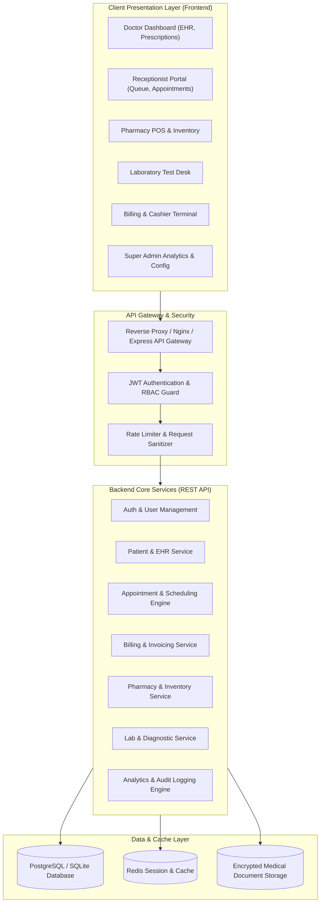

# Clinic ERP System Architecture

## 1. System Overview

Clinic ERP is structured around a decoupled, micro-modular client-server architecture designed for high availability, HIPAA compliance readiness, auditability, and clinical workflow efficiency.

---

## 2. Core Architectural Pillars

### A. Role-Based Access Control (RBAC)
Security is enforced both at the gateway and the service layer. Every request contains an authenticated JWT with role scopes:
- **`SUPER_ADMIN`**: Full administrative privileges, audit logs, doctor roster configuration, user provisioning.
- **`DOCTOR`**: Access to assigned patient records, clinical notes, diagnosis codes (ICD-10), digital prescriptions, lab orders.
- **`RECEPTIONIST`**: Patient intake, scheduling, queue prioritization, walk-in registration, preliminary vitals intake.
- **`PHARMACIST`**: Prescription fulfillment, medicine stock catalog, batch/expiry alerts, direct sales, restocking.
- **`LAB_TECH`**: Specimen accessioning, test entry, diagnostic results upload, status transition (Pending -> Processing -> Completed).
- **`ACCOUNTANT / CASHIER`**: Invoices, payment receipts, refunds, tax summaries, insurance co-pay tracking.
- **`PATIENT`**: Self-service portal (viewing past encounters, lab reports, booking appointments).

### B. High Reliability & Data Integrity
- Atomic transactions for multi-step operations (e.g., dispensing medicine updates pharmacy inventory and creates invoice items in a single transaction).
- Detailed immutable audit trail logging all EHR modifications, sensitive data access, and financial transactions.

---

## 3. Communication Protocols

- **RESTful API**: Clean JSON REST endpoints versioned under `/api/v1/*`.
- **WebSocket / Server-Sent Events (SSE)**: For real-time appointment queue status updates and low-stock alerts.
